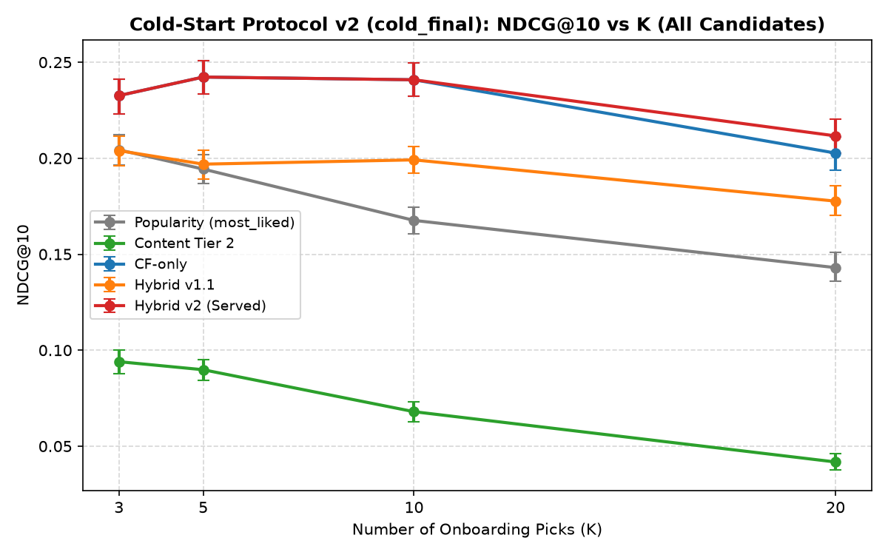
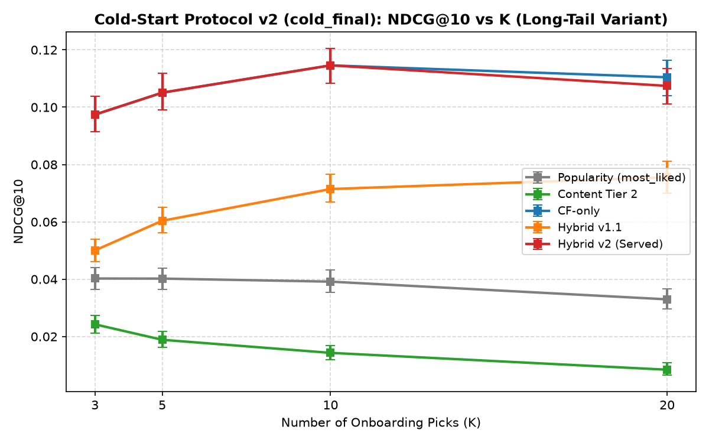
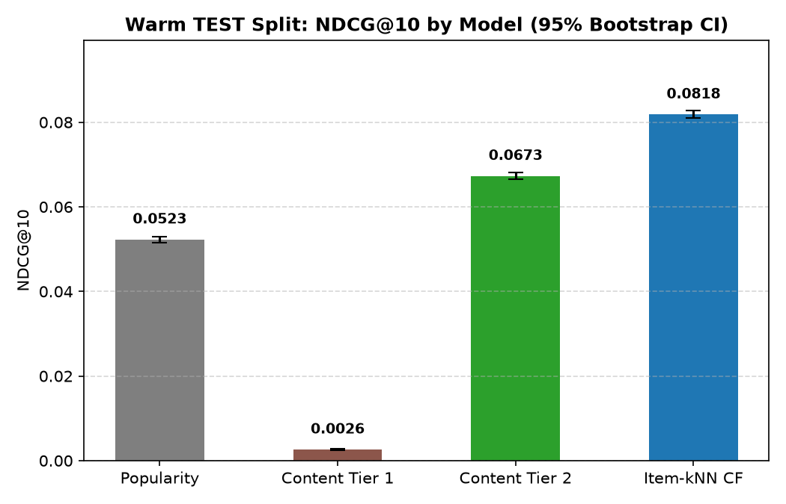
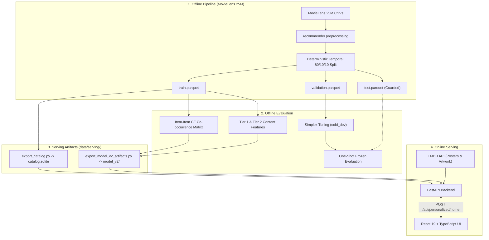
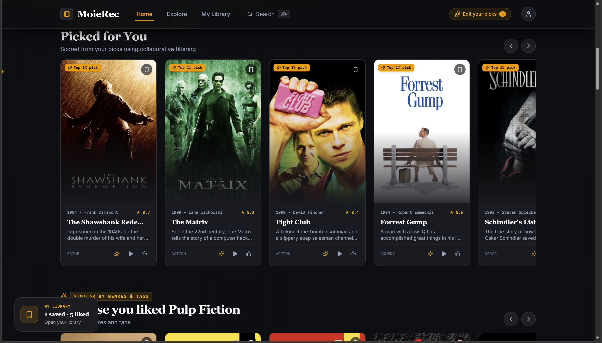
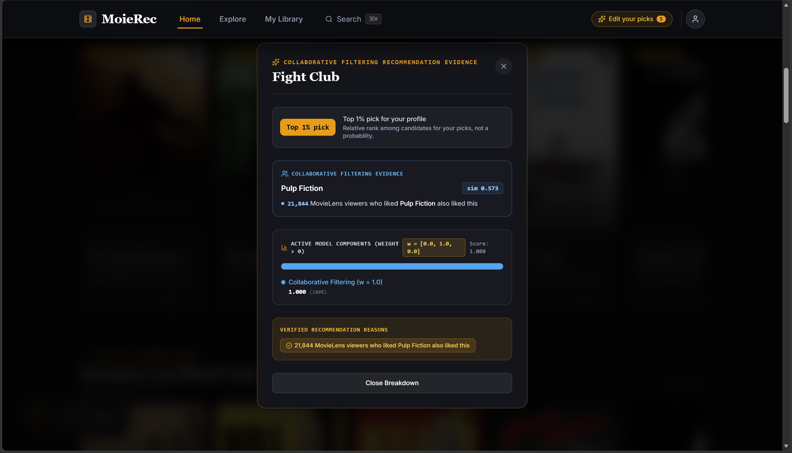
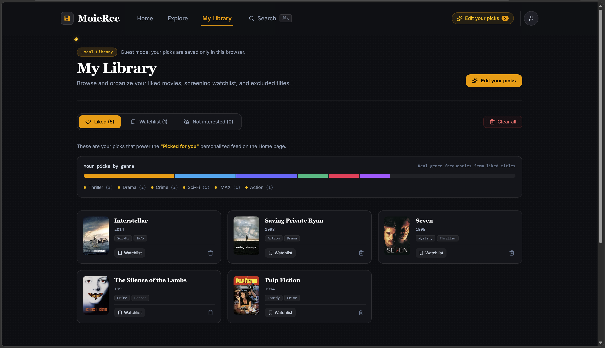
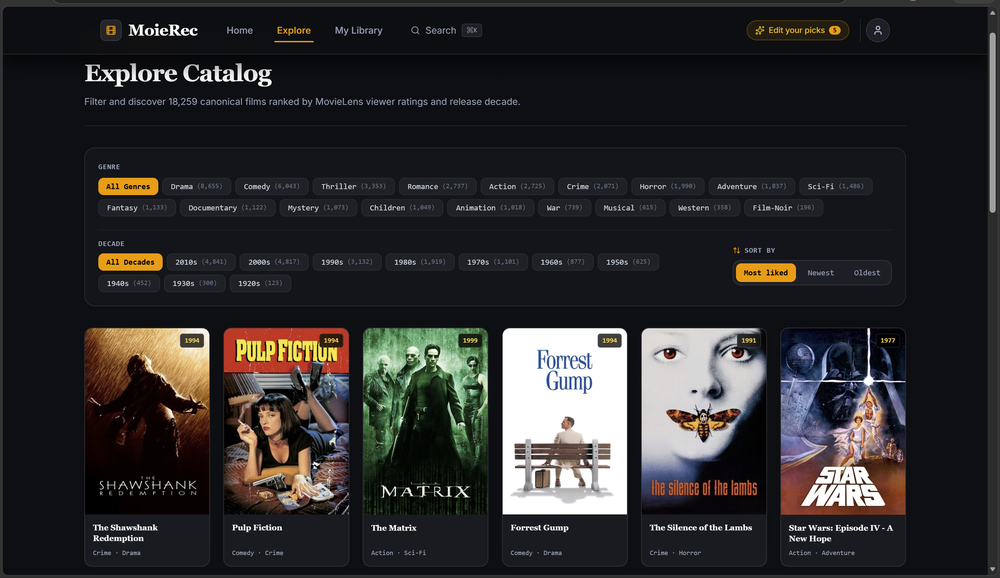

# MoieRec

A personalized, explainable movie recommendation engine and web application evaluated on MovieLens 25M, powered by item-item collaborative filtering with evidence-based explanations.

[](https://www.python.org/)
[](https://fastapi.tiangolo.com/)
[](https://react.dev/)
[](https://www.typescriptlang.org/)
[](#overview)

---

## Table of Contents
- [Overview](#overview)
- [Highlights](#highlights)
- [Evaluation Results](#evaluation-results)
- [How It Works](#how-it-works)
- [Screenshots](#screenshots)
- [Run It Locally](#run-it-locally)
- [Repository Structure](#repository-structure)
- [Design Decisions & Lessons](#design-decisions--lessons)
- [Limitations & Future Work](#limitations--future-work)
- [Data & Credits](#data--credits)
- [License](#license)

---

## Overview

**MoieRec** is a full-stack movie recommendation platform combining an audited offline machine learning pipeline (trained on MovieLens 25M) with a production-grade FastAPI backend and an interactive React 19 web application. It bridges the gap between offline recommender benchmarking and end-user interactive serving.

### What You Can Do
- **Pick Movies You Love**: Seed an onboarding taste profile with 3 or more favorite films, or search and pick from the catalog at any time.
- **Personalized Recommendations**: Receive real-time ranking rails (*Picked for You*, *Because you liked &lt;Title&gt;*) scored dynamically from your active picks.
- **Evidence-Based Explanations**: Inspect any recommendation in the "Why This?" modal to see verified collaborative evidence (*"N MovieLens viewers who liked X also liked this"*), shared tags, and honest percentile chips (*"Top N% pick"*).
- **Explore & Filter**: Browse the catalog across 19 genres, release decades, and non-personalized popularity baselines.
- **Manage Your Library**: Save movies to your Watchlist, track Liked titles, and record ratings entirely within your browser.

### Deliberately Out of Scope
- **No Remote Accounts**: All user profiles, watchlists, and seed picks live client-side in browser `localStorage`. No database accounts, passwords, or JWT sessions exist.
- **Not Deployed to the Cloud**: Designed and structured strictly as a reproducible local engineering benchmark and developer demonstration.
- **Catalog Horizon Ends in 2019**: Built on the official MovieLens 25M dataset; releases, ratings, and catalog entries terminate in late 2019.

---

## Highlights

- **MovieLens 25M Scale**: Evaluated across 25,000,095 ratings spanning 62,423 titles from 162,541 users, reduced via iterative k-core filtering to an 18,276-movie benchmark catalog.
- **Leakage-Audited Temporal Split**: Enforces an 80/10/10 chronological per-user split with candidate masking to ensure evaluations test forward-in-time prediction rather than retrospective memorization.
- **Paired Bootstrap Confidence Intervals**: User-level 95% bootstrap intervals (1,000 resamples) accompany all metrics and paired model comparisons ($\Delta\text{NDCG@10}$).
- **Frozen One-Shot Final Evaluation**: All weights, hyperparameters, and feature blocks were locked on validation data; final numbers were gathered in a single, unretuned pass against guarded held-out partitions (`cold_final` and `test.parquet`).
- **Evidence-Based Explanations**: Recommendations present authentic co-viewer counts and feature overlaps; misleading marketing jargon like *"% match"* or *"acclaimed"* is prohibited by design.
- **Tie-Break Bias Discovered & Fixed**: Empirical audits revealed that default index tie-breaking silently injected a strong negative popularity prior (Spearman $r = -0.5340$), artificially inflating content metrics by +120%; replaced throughout with unbiased uniform random permutations.

---

## Evaluation Results

### Served Model Architecture
The production serving engine executes **item-based collaborative filtering** (asymmetric cosine similarity, $a=0.5$, shrinkage $\lambda=0.0$, top-$k=200$ neighbors) scored dynamically by averaging similarity vectors across the user's active picks.

The scoring schedule was selected on the validation simplex (`cold_dev`):
- **$K \le 14$ seed picks**: **Pure Item-Item CF** ($w_{\text{cf}} = 1.0, w_{\text{content}} = 0.0, w_{\text{pop}} = 0.0$).
- **$K \ge 15$ seed picks**: **90% CF / 10% Content** ($w_{\text{cf}} = 0.9, w_{\text{content}} = 0.1, w_{\text{pop}} = 0.0$).
- *In practice, the system is an adaptive neighborhood CF engine with light content smoothing at high pick counts, not a three-way blend (popularity receives zero weight).*

### Primary Benchmark Metrics

#### 1. Warm TEST Split ($N = 94,604$ evaluated users, final fit on Train + Validation)
| Model | NDCG@10 (95% CI) | Hit Rate@10 (95% CI) | Relative Lift vs Popularity |
| :--- | :---: | :---: | :---: |
| **Popularity** (`most_liked`) | 0.0523 [0.0515, 0.0530] | 0.2557 [0.2528, 0.2583] | Baseline |
| **Content Tier 2** *(snapshot features: tags/genome leak in evaluation)* | 0.0673 [0.0665, 0.0682] | 0.3197 [0.3168, 0.3227] | +28.75% |
| **Item-kNN CF** ($k=200, a=0.5$) | **0.0818 [0.0810, 0.0828]** | **0.3580 [0.3551, 0.3612]** | **+56.40%** |

#### 2. Cold-Start Final Long-Tail ($K = 5$ onboarding picks, top-200 popular movies excluded, $N = 2,372$ users)
| Model | NDCG@10 (95% CI) | Relative Lift vs Popularity |
| :--- | :---: | :---: |
| **Popularity** (`most_liked`) | 0.0402 [0.0365, 0.0438] | Baseline |
| **Item-kNN CF** (Served Hybrid v2) | **0.1051 [0.0991, 0.1118]** | **+161.28%** |

### Evaluation Visualizations

*Figure 1: NDCG@10 across all 18,277 candidate movies on held-out cold_final users as onboarding picks K increase.*


*Figure 2: NDCG@10 on the long-tail variant (excluding top-200 popular training movies), demonstrating CF's niche discovery.*


*Figure 3: Warm evaluation metrics at Top-10 on the held-out TEST split with 95% bootstrap error bars.*

### How It Was Evaluated
- **Per-User Temporal Split**: User histories were partitioned chronologically (80% train, 10% validation, 10% test) with seeded tie-breaking to avoid split bias.
- **Positive Threshold**: Only ratings $r \ge 4.0$ are counted as positive interactions; lower ratings are treated as non-relevant.
- **Paired Bootstrap CIs**: 1,000 bootstrap iterations compute user-level confidence bounds and paired comparison significance.
- **Leakage Audit with Shuffled Negative Control**: Item similarities built on randomly shuffled user interaction histories produced NDCG@10 of 0.05198 vs Popularity 0.05183, confirming zero artificial advantage.
- **One-Shot Frozen Run**: Execution completed in 974.45 seconds on held-out `cold_final` and warm `TEST` without hyperparameter re-tuning.

For detailed breakdowns, activity strata, and full comparison matrices, see [docs/ml/final_results.md](docs/ml/final_results.md).

---

## How It Works



### The Serving Flow
1. **User Picks in Browser**: The user selects favorite movies during onboarding or browsing; IDs are stored in browser `localStorage`.
2. **Personalized Request**: Frontend issues `POST /api/personalized/home` sending the active array of liked MovieLens IDs.
3. **Item-kNN Scoring**: The FastAPI backend looks up precomputed top-200 neighbor arrays and computes average similarity scores across picks.
4. **Metadata & TMDB Enrichment**: High-ranking items are joined with `catalog.sqlite` and enriched with cached TMDB poster art and overviews.
5. **Feed Delivery with Evidence**: The feed returns ranked rails with reason codes, shared tags, and exact co-watcher counts (*"N MovieLens viewers who liked X also liked this"*).

---

## Screenshots


*Figure 4: Personalized home feed featuring the "Picked for You" recommendation rail and rank chips.*


*Figure 5: "Why This?" modal presenting verified MovieLens co-viewer evidence and shared feature attribution.*


*Figure 6: Personal library view managing user ratings, watchlist, and liked titles.*


*Figure 7: Explore catalog view with multi-genre and release decade filters.*

---

## Run It Locally

<details>
<summary><b>1. Prerequisites & Environment Setup</b></summary>

- **Python**: Version 3.10 to 3.14 (backend works on 3.10+, recommender dependencies tested on 3.10+ / 3.14).
- **Node.js**: Version 18+ and npm.
- **Git**: Installed and available in PATH.
- **TMDB API Key**: Free API key from [themoviedb.org](https://www.themoviedb.org/documentation/api).

Create two isolated Python virtual environments from the project root:
```powershell
# Backend runtime environment
python -m venv .venv
.\.venv\Scripts\python.exe -m pip install -r backend/requirements.txt

# Recommender ML environment
python -m venv .venv_recommender
.\.venv_recommender\Scripts\python.exe -m pip install -r recommender/requirements.txt
```
</details>

<details>
<summary><b>2. Data Pipeline & Model Artifact Generation</b></summary>

Run all recommender commands as modules from the project root using `.venv_recommender`:

```powershell
# Step 1: Download MovieLens 25M and verify checksum
.\.venv_recommender\Scripts\python.exe -m recommender.preprocessing.download_movielens --dataset ml-25m

# Step 2: Parse raw CSVs into normalized Parquet tables
.\.venv_recommender\Scripts\python.exe -m recommender.preprocessing.parse_movielens --dataset ml-25m

# Step 3: Build activity-filtered benchmark catalog (iterative k-core)
.\.venv_recommender\Scripts\python.exe -m recommender.preprocessing.build_benchmark --dataset ml-25m

# Step 4: Perform deterministic per-user temporal 80/10/10 split
.\.venv_recommender\Scripts\python.exe -m recommender.preprocessing.split_dataset --dataset ml-25m

# Step 5: Build ID mappings and content feature matrices
.\.venv_recommender\Scripts\python.exe -m recommender.preprocessing.build_content_features --dataset ml-25m

# Step 6: Export serving SQLite catalog
.\.venv_recommender\Scripts\python.exe -m recommender.serving.export_catalog

# Step 7: Build collaborative filtering neighbor cache and tune simplex schedule
.\.venv_recommender\Scripts\python.exe -m recommender.hybrid.tune_hybrid_v2

# Step 8: Export baseline and compact model_v2 serving artifacts
.\.venv_recommender\Scripts\python.exe -m recommender.serving.export_model_artifacts
.\.venv_recommender\Scripts\python.exe -m recommender.serving.export_model_v2_artifacts
```
</details>

<details>
<summary><b>3. TMDB Configuration & Cache Warming</b></summary>

Create `backend/.env` by copying `backend/.env.example` and set your TMDB API key:
```powershell
# Copy the template
Copy-Item backend/.env.example backend/.env
```
Edit `backend/.env` and replace `your_tmdb_api_key_here` with your valid key:
```env
TMDB_API_KEY=your_actual_tmdb_v3_key
```

Pre-warm the SQLite artwork cache (`data/serving/tmdb_cache.sqlite`) for top catalog titles:
```powershell
.\.venv\Scripts\python.exe -m app.scripts.warm_tmdb_cache --top 3000
```
</details>

<details>
<summary><b>4. Starting the Application Servers</b></summary>

Open two separate terminal windows at the repository root:

**Terminal 1 — FastAPI Backend**
```powershell
.\.venv\Scripts\uvicorn.exe app.main:app --app-dir backend --host 127.0.0.1 --port 8000 --reload
```
- Interactive API Docs: `http://127.0.0.1:8000/docs`
- Health Endpoint: `http://127.0.0.1:8000/api/health`

**Terminal 2 — React Frontend**
```powershell
cd frontend
npm install
npm run dev
```
- Web Application: `http://localhost:5173`

*To stop the servers at any time, press `Ctrl + C` in both terminal windows.*
</details>

<details>
<summary><b>5. Running Automated Tests</b></summary>

```powershell
# Run backend API tests
.\.venv\Scripts\pytest.exe backend/tests

# Run recommender parity and evaluation tests
.\.venv_recommender\Scripts\pytest.exe recommender/tests
```
</details>

<details>
<summary><b>6. Reproducing the Final Evaluation (Read-Only)</b></summary>

The frozen benchmark evaluation was executed via:
```powershell
.\.venv_recommender\Scripts\python.exe scratch/execute_final_evaluation.py
```
> [!WARNING]
> **One-Shot Guards**: The evaluation runner enforces strict guards. Accessing `test.parquet` or `cold_final` without `final=True` and a matching `frozen_config_id` raises a `PermissionError`. The benchmark script was designed to execute once; rerun only if verifying bitwise reproducibility.
</details>

<details>
<summary><b>7. Troubleshooting</b></summary>

- **ISP / DNS Blocking `api.themoviedb.org`**: Some ISPs block or throttle TMDB API requests, causing artwork timeouts or TLS reset errors. Switch your machine's DNS to `1.1.1.1` (Cloudflare) or `8.8.8.8` (Google), or connect through an alternative network.
- **SQLite Database Locked**: On Windows, Uvicorn holds an active file lock on `data/serving/catalog.sqlite` and `data/serving/tmdb_cache.sqlite`. You **must stop the backend** (`Ctrl + C`) before re-running `export_catalog.py` or `warm_tmdb_cache.py`.
- **Module Import Errors**: Always execute recommender scripts with the `-m` flag from the repository root (e.g. `python -m recommender.serving.export_catalog`) rather than executing files directly by file path, ensuring Python resolves package imports correctly.
</details>

---

## Repository Structure

```
MoieRec/
├── backend/                  # FastAPI REST API application
│   ├── app/
│   │   ├── api/              # Route endpoints (/health, /movies, /personalized)
│   │   ├── core/             # Environment configuration and settings
│   │   ├── db/               # SQLite catalog and TMDB cache clients
│   │   ├── schemas/          # Pydantic request and response schemas
│   │   ├── scripts/          # TMDB cache warming utilities
│   │   └── services/         # Recommender adapters and TMDB client
│   ├── requirements.txt      # Backend Python dependencies
│   └── tests/                # Endpoint integration tests
│
├── frontend/                 # React 19 + TypeScript web application
│   ├── src/
│   │   ├── components/       # Cinematic UI components and modals
│   │   ├── pages/            # Home, Explore, Library, and Onboarding
│   │   ├── services/         # API HTTP client functions
│   │   └── types/            # TypeScript interfaces
│   └── package.json          # Node dependencies and scripts
│
├── recommender/              # Decoupled machine learning engine
│   ├── baselines/            # Non-personalized popularity models
│   ├── collaborative/        # Item-item collaborative filtering
│   ├── config/               # Model hyperparameters and dataset settings
│   ├── content_based/        # TF-IDF, metadata features, and cosine scorers
│   ├── evaluation/           # Temporal split protocol, cold-start, metrics
│   ├── hybrid/               # Simplex fusion and tuning routines
│   ├── preprocessing/        # MovieLens ETL, k-core filtering, splitters
│   ├── results/              # Evaluation results (including results/final/)
│   ├── serving/              # Fast compact inference scorer and exporters
│   └── tests/                # Parity and regression test suite
│
├── docs/                     # Technical specifications and research reports
│   ├── figures/              # Generated benchmark charts and curves
│   └── ml/                   # Per-model design notes and final results
│
├── data/                     # Local data partitions (Git-ignored)
├── .env.example              # Environment variables template
└── README.md                 # Project documentation
```

---

## Design Decisions & Lessons

- **Genre-Only Content Is Nearly Useless as a Ranker**: Across an 18,276-movie catalog, coarse genre vectors achieve an NDCG@10 of only 0.0026 on warm test users. Thousands of titles share identical genre sets; genre alone cannot differentiate celebrated masterpieces from obscure low-budget releases.
- **Evaluator Tie-Break Bias Found & Fixed**: Early evaluations used default index tie-breaking, which unknowingly correlated with movie release order and introduced a hidden popularity prior (Spearman $r = -0.5340$), artificially inflating content NDCG by +120%. Replacing tie-breaking with seeded uniform random permutations (`random_perm`) eliminated this artifact across all benchmarks.
- **Popularity Is a Formidable Baseline**: The non-personalized `most_liked` model achieves an NDCG@10 of 0.0523 on warm test. Complex recommender architectures frequently lose to well-tuned popularity baselines unless disciplined co-occurrence signals are utilized.
- **Tier 2 Snapshot Tag Features Leak**: MovieLens tags and tag-genome scores reflect collective platform activity accumulated up to 2019. Recommending a 1995 film using tags applied in 2018 introduces temporal look-ahead; consequently, Tier 2 is strictly documented and reported as a snapshot experiment.
- **Negative Control Proved Authenticity**: When user interaction lists were randomly shuffled to destroy co-occurrence while preserving marginal popularity, item CF NDCG@10 plummeted from 0.0818 to 0.05198 (matching Popularity at 0.05183), proving the observed collaborative lift originates purely from real behavioral co-occurrence.

---

## Limitations & Future Work

- **2019 Dataset Horizon**: The MovieLens 25M dataset concludes in November 2019. The catalog does not contain modern theatrical releases, streaming-era titles, or contemporary cinema.
- **Tier 2 Snapshot Leakage**: Tag applications and genome matrices aggregate post-release impressions, creating optimistic feature availability in historical evaluations.
- **Simulated Onboarding Approximation**: The offline cold-start protocol approximates user onboarding using a user's first $K$ organic ratings, whereas live web onboarding involves active user browsing.
- **Binary Positivity in Neighborhood CF**: The collaborative model treats ratings $\ge 4.0$ as positive approvals and ignores sub-4.0 distinctions. Latent factor modeling (ALS, SVD) and explicit dislike handling represent clear avenues for extension.
- **Client-Side Guest Profiles**: Session profiles reside solely in browser `localStorage`. Profiles do not synchronize across devices or persist across browser cache purges.
- **Local Architecture**: MoieRec is engineered as a reproducible local demonstration rather than a horizontally scaled cloud deployment.

---

## Data & Credits

- **MovieLens 25M**: Provided by GroupLens Research at the University of Minnesota.  
  *Citation*: F. Maxwell Harper and Joseph A. Konstan. 2015. *The MovieLens Datasets: History and Context*. ACM Transactions on Interactive Intelligent Systems (TiiS) 5, 4: 19:1–19:19. Dataset available at [files.grouplens.org](https://files.grouplens.org/datasets/movielens/ml-25m.zip). Data is not redistributed in this repository.
- **TMDB API Notice**: This product uses the TMDB API but is not endorsed or certified by TMDB.

---

## License

License: Not yet specified (TBD).
