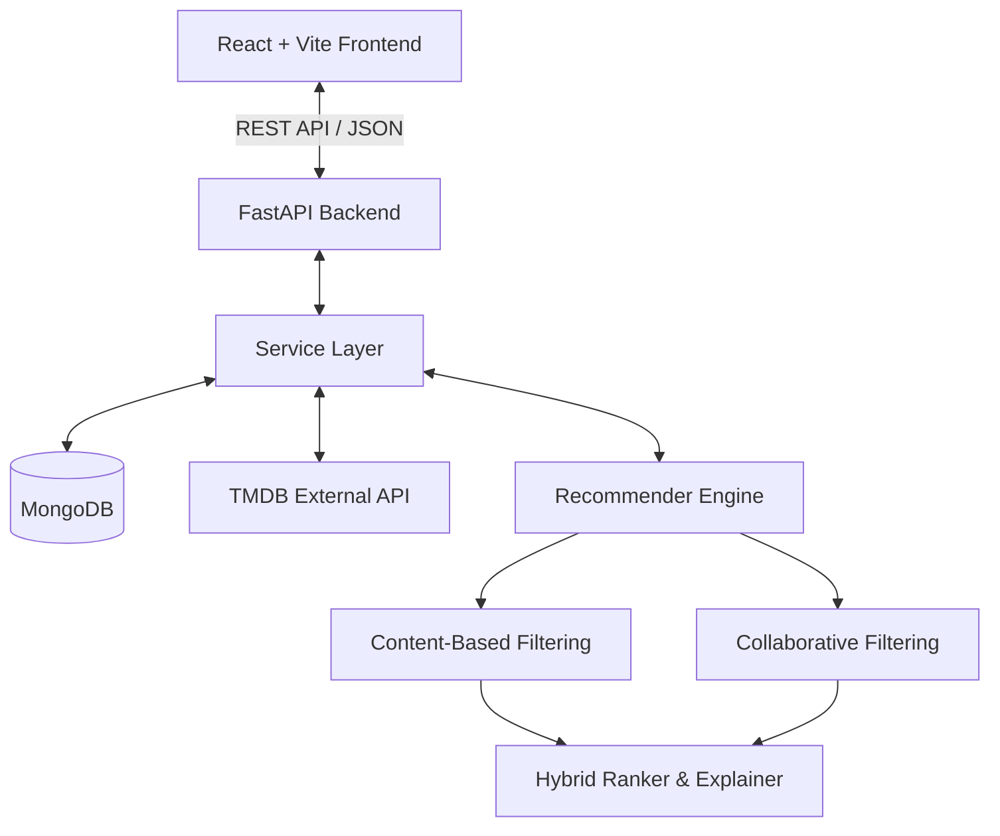

# MoieRec System Architecture

## Overview
MoieRec is a personalized, explainable movie recommendation platform designed as a modular full-stack machine learning application.

## Layers

1. **Frontend (`frontend/`)**:
   - Single Page Application built with React, Vite, TypeScript, and Tailwind CSS.
   - Clean separation of UI components, pages, hooks, and API services.
   - Designed for a cinematic, dark-mode user experience.

2. **Backend API (`backend/`)**:
   - High-performance asynchronous REST API powered by FastAPI and Uvicorn.
   - Modular structure: routers (`api/`), configuration (`core/`), schemas (`schemas/`), database connectors (`db/`), and business logic (`services/`).
   - CORS-configured for seamless local frontend communication.

3. **Recommender Core (`recommender/`)**:
   - Independent Python ML package containing data preprocessing pipelines, content-based vectorizers, collaborative filtering matrix factorization, and an explainable hybrid re-ranking module.
   - Decoupled from HTTP transport concerns, allowing standalone training, offline evaluation, and clean service integration.

4. **Data Management (`data/`)**:
   - Structured partitions for raw external dumps, processed model matrices, and external ID mappings.
   - Git-ignored to maintain repository hygiene.
